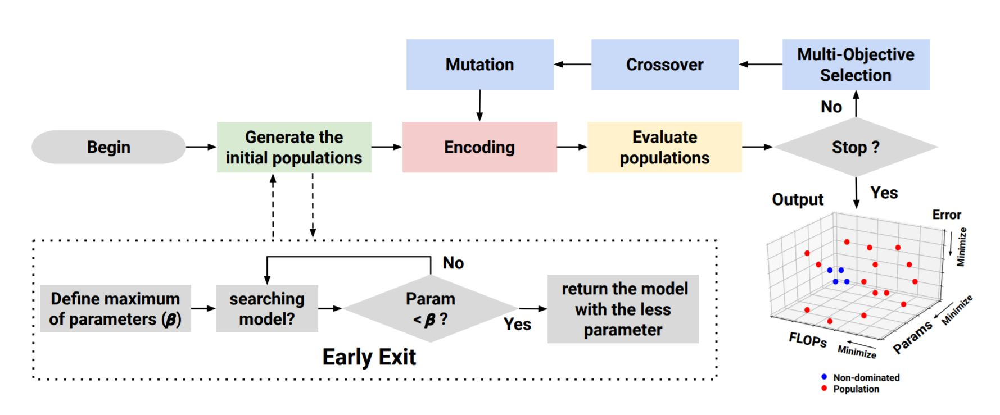
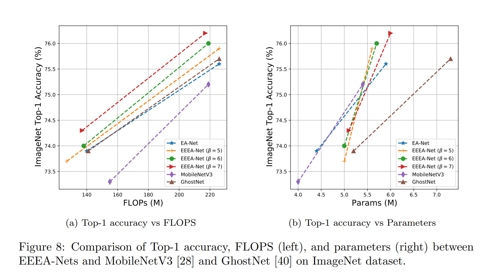

# [EEEA-Net: An Early Exit Evolutionary Neural Architecture Search](https://www.sciencedirect.com/science/article/pii/S0952197621002451)

**This paper has been published to Engineering Applications of Artificial Intelligence.**

This implementation of EEEA-Net (Early Exit Evolutionary Algorithm Network) from EEEA-Net: An Early Exit Evolutionary Neural Architecture Search by [Chakkrit Termritthikun](https://chakkritte.github.io/cv/), et al.

<p align="center">
  
</p>


**This code is based on the implementation of  [DARTS](https://github.com/quark0/darts), [NSGA-Net](https://github.com/ianwhale/nsga-net), [NSGA-Net-v2](https://github.com/mikelzc1990/nsganetv2), [Once for All](https://github.com/mit-han-lab/once-for-all), and [TransferLearning-Tasks](https://github.com/EMI-Group/TransferLearning-Tasks).**

## Results

<p align="center">
  
</p>

## Prerequisite for server
 - Tested on Ubuntu OS version 18.04.x
 - Tested on PyTorch 1.6 and TorchVision 0.7.0


## Quick Usage (EEEA-Net, ImageNet pre-trained)

#### install darmo package
```
pip install darmo
```

#### import darmo and create model; see more models at [darmo](https://github.com/jitdee-ai/darmo)
```
import darmo
model = darmo.create_model("eeea_c2", num_classes=1000, pretrained=True)
```

#### supported transfer learning
```
model.reset_classifier(num_classes=100, dropout=0.2)
```

## Usage

### Cloning source code

```
git clone https://github.com/chakkritte/EEEA-Net/
cd EEEA-Net/EEEA/cifar
```

### Install Requirements

```
pip install -r requirements.txt
```

### Architecture search on CIFAR-10 (Normal search)

```
python search_space.py --dataset cifar10 --search normal --th_param 0.0 
```

### Architecture search on CIFAR-10 (Early Exit search with beta equal 5)

```
python search_space.py --dataset cifar10 --search ee --th_param 5.0 
```

### Architecture evaluation on CIFAR-10 

```
python train_cifar.py --arch [name]
```

#### *[name] is mean a name of models [EA, EEEA_A, EEEA_B, EEEA_C]


## Citation

If you use EEEA-Net or any part of this research, please cite our paper:
```
  @article{TERMRITTHIKUN2021104397,
  title = {EEEA-Net: An Early Exit Evolutionary Neural Architecture Search},
  journal = {Engineering Applications of Artificial Intelligence},
  volume = {104},
  pages = {104397},
  year = {2021},
  issn = {0952-1976},
  doi = {https://doi.org/10.1016/j.engappai.2021.104397},
  url = {https://www.sciencedirect.com/science/article/pii/S0952197621002451},
  author = {Chakkrit Termritthikun and Yeshi Jamtsho and Jirarat Ieamsaard and Paisarn Muneesawang and Ivan Lee},
  keywords = {Deep learning, Neural Architecture Search, Multi-Objective Evolutionary Algorithms, Image classification},
  }
```
## License 

Apache-2.0 License
